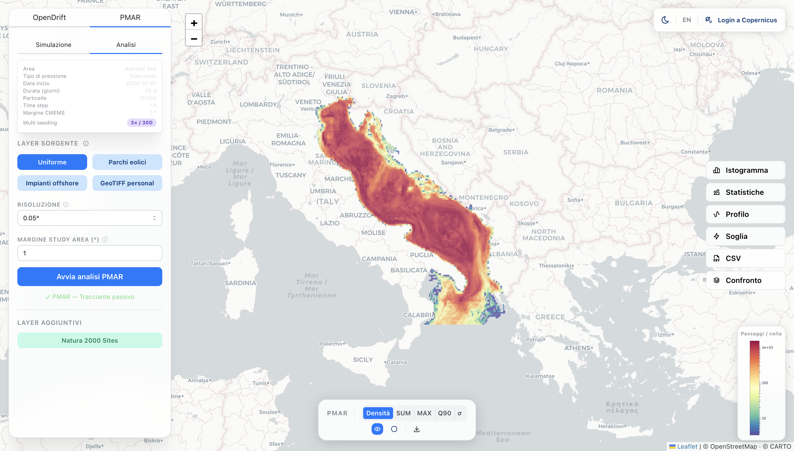
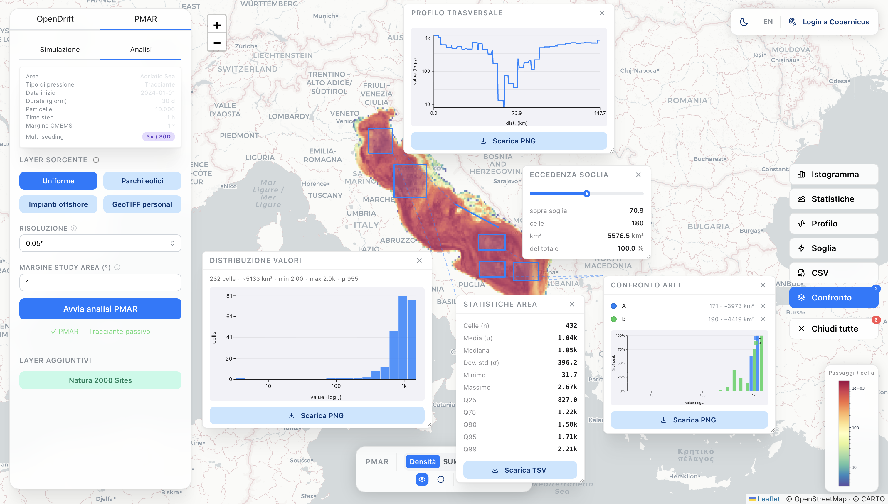

# Tools4MSP-PMAR

A DTO web application for on-demand anthropogenic pressure modelling and assessment based on the [PMAR](https://github.com/CNR-ISMAR/pmar.git) package. It combines an OGC API Processing backend with an interactive map frontend to simulate how substances and organisms disperse under real ocean data, and to compute particle density maps with the PMAR engine. It dinamically connects to Copernicus Marine for ocean models and EMODnet for human activities data. 

## GUI Preview


<p align="center">PMAR analysis - particle density heatmap using Tracer model. Res 0.05º.
</p>

<br>


<p align="center">PMAR analysis - particle density heatmap using Tracer model. Res 0.05º. Tools as floating windows on top.</p>

## Architecture

```
DTO-PMAR/
├── processes/
│   ├── OpenDriftProcess.py              # OGC API process: runs OpenDrift with CMEMS data
│   ├── PMARProcess.py                   # OGC API process: PMAR density analysis on a precomputed scenario
│   ├── PrecomputeProcess.py             # OGC API process: precomputes and stores a trajectory NC file
│   ├── ScenarioStatusProcess.py         # OGC API process: lists saved scenarios + Tools4MSP areas
│   ├── WindfarmsProcess.py              # OGC API process: EMODnet wind farm preview (bbox query)
│   ├── OffshoreInstallationsProcess.py  # OGC API process: EMODnet offshore installations preview
│   ├── Natura2000Process.py             # OGC API process: Natura 2000 protected areas (EmodNet)
│   └── logging_utils.py                 # Shared log handler with line-count rotation
├── worker/
│   ├── app.py                           # Celery application instance
│   ├── manager.py                       # Job lifecycle helpers
│   └── tasks.py                         # Celery tasks (async precompute)
├── frontend/
│   ├── src/                             # React 19 + Vite SPA (Mantine v9, react-leaflet)
│   ├── Dockerfile                       # Multi-stage build → nginx
│   ├── nginx.conf                       # Static serving + API proxy
│   └── nginx.conf.template              # Template for environment-variable substitution
├── scripts/
│   ├── start.sh                         # Dev: regenerate OpenAPI spec and start pygeoapi
│   ├── entrypoint.sh                    # Docker entrypoint for backend container
│   └── init-letsencrypt.sh              # Let's Encrypt certificate bootstrap helper
├── cache/
│   ├── cmems_*_cur_*.nc                 # Ocean currents
│   ├── cmems_*_wind_*.nc                # Wind
│   ├── cmems_*_wav_*.nc                 # Waves (Stokes drift)
│   ├── cmems_*_tem_*.nc                 # Temperature & salinity
│   ├── cmems_*_bathy_*.nc               # Bathymetry (geographic cache, no time key)
│   └── emodnet/                         # EMODnet WFS responses (pickle, 7-day TTL)
├── scenarios/
│   ├── custom_<id>.nc                   # Precomputed trajectory files
│   ├── custom_<id>.json                 # Scenario metadata (params, shapefile path, label)
│   └── shapefiles/
│       ├── custom_<id>.shp              # Seeding area shapefiles for custom scenarios
│       └── t4msp_<area_id>.shp          # Cached Tools4MSP area geometries
├── out/                                 # Temporary simulation outputs (cleaned on startup)
├── Dockerfile                           # Backend image (pygeoapi + processes)
├── docker-compose.yml                   # Orchestrates backend, celery-worker, redis, frontend
├── pygeoapi-config.yml
└── .env                                 # Runtime secrets (not committed)
```

**Backend:** [pygeoapi](https://pygeoapi.io) (port 5001) exposes all processes via the OGC API - Processes standard. Long-running precomputations are offloaded to a **Celery** worker backed by **Redis**.

**Frontend:** React 19 + Vite SPA with Mantine v9 and react-leaflet. In production it is built into a static bundle and served by **nginx**, which also proxies `/processes/*` to the backend. Communicates with the backend via `POST /processes/<process>/execution`.

## Requirements

- Docker and Docker Compose
- A `.env` file with runtime secrets (see below)
- A `.git_token` file containing a GitHub personal access token with read access to the private PMAR repo (used only at image build time)
- A free [Copernicus Marine](https://marine.copernicus.eu/) account

## Getting started

```bash
git clone <repo>
cd DTO-PMAR
# Copy .env.example to .env and fill in your credentials
# Place your GitHub token in .git_token
docker compose up --build -d
```

The frontend is served at `http://localhost:80`. The backend runs on port 5001 (internal only). The Celery worker and Redis are started automatically.

`cache/`, `out/`, and `scenarios/` are tracked in git as empty directories (via `.gitkeep`) so Docker can mount them with correct permissions from the first run.

## OpenDrift process

**Endpoint:** `POST /processes/opendrift/execution`

### Drift models

| Key | Description | Wind | Waves | T/S | Vertical |
|---|---|---|---|---|---|
| `OceanDrift` | Passive tracer — surface currents only | — | — | — | — |
| `PlastDrift` | Plastic debris — Stokes drift + wind drag | Yes | Yes | — | — |
| `LarvalFish` | Fish larvae/eggs — vertical buoyancy + turbulent mixing | — | — | — | Yes |
| `OpenOil` | Hydrocarbons — evaporation, emulsification, dispersion | Yes | Yes | Yes | Yes |

Models marked **Vertical** use dynamic CMEMS depth: the seafloor depth (`deptho`) is downloaded once per area and cached; `maximum_depth = max(deptho) + 10 m` is used for the currents download instead of a fixed value.

### Inputs

| Parameter | Description | Default |
|---|---|---|
| `seeding_type` | `circle` or `rectangle` | `circle` |
| `lon`, `lat`, `radius` | Centre and radius (m) for circle seeding | — |
| `lon_min/max`, `lat_min/max` | Bounding box for rectangle seeding | — |
| `model` | Drift model key (see table above) | `OceanDrift` |
| `start_time` | ISO 8601 datetime | 3 days ago |
| `number` | Number of particles (max 10 000) | 100 |
| `duration_hours` | Simulation duration in hours (max 720) | 24 |

### Output

JSON with `times` (ISO timestamps array), `steps` (per-timestep particle positions `[lon, lat]`), and `model` name.

## PMAR workflow

The PMAR panel uses a two-step workflow split across two tabs.

### Tab 1 — Simulation

The user defines a seeding area and simulation parameters, then triggers a **precomputation** that runs OpenDrift and saves the trajectory to disk. The result is a named scenario that can be reused for multiple analyses without re-running the simulation.

**Seeding area options:**

| Mode | Description |
|---|---|
| Draw | Circle or rectangle drawn interactively on the map. Supports a custom area name. |
| Shapefile | ZIP archive containing `.shp`, `.shx`, `.dbf` files |
| Pre-defined area | Geographic area from the [Tools4MSP API](https://api.tools4msp.eu/api/v2/domainareas/) |

**Simulation parameters:**

| Parameter | Range | Default |
|---|---|---|
| Title | Free text | Auto-generated from pressure + date |
| Description | Free text | — |
| Pressure type | `generic`, `plastic`, `oil`, `larvae` | `generic` |
| Start date | ISO 8601 date | 10 days ago |
| Duration | 1–730 days | 30 |
| Particles | 10–100 000 | 1 000 |
| Time step | 1, 3, 6, 12, 24 h | 1 h |
| CMEMS margin | 0–20° | 5° |

A live estimate of the temporary NetCDF file size is shown below the form, colour-coded by severity (normal / caution >500 MB / warning >2 GB).

Once submitted, the precomputation runs asynchronously. The job is polled every 5 seconds and the new scenario appears automatically in the list when ready.

Existing simulations are listed in a dropdown at the top of the tab. Selecting one shows a summary: area name, pressure type, start date, duration, particles, time step, CMEMS margin, and description.

### Tab 2 — Analysis

Once a simulation is selected from the Simulation tab, the Analysis tab allows running the PMAR density analysis on it with different configurations without re-running the OpenDrift simulation.

**Analysis parameters:**

| Parameter | Options | Default |
|---|---|---|
| Source layer | `Uniform`, `Wind farms`, `Offshore installations`, `Custom GeoTIFF` | `Uniform` |
| Grid resolution | 0.001°, 0.01°, 0.05°, 0.1°, 0.2°, 0.5°, 1.0° | 0.1° |
| Study area margin | 0–20° | 1° |

Running the analysis produces a particle density heatmap overlaid on the map.

## Precompute process

**Endpoint:** `POST /processes/precompute/execution`  
**Execution mode:** asynchronous (`Prefer: respond-async`)

Runs an OpenDrift simulation, saves the trajectory as `scenarios/custom_<id>.nc`, and writes metadata to `scenarios/custom_<id>.json`.

### Inputs

| Parameter | Description |
|---|---|
| `geojson` | GeoJSON string of the seeding area |
| `shapefile_b64` | Base64-encoded shapefile ZIP (alternative to GeoJSON) |
| `t4msp_area_id` | Integer ID of a Tools4MSP domain area (alternative to GeoJSON) |
| `pressure` | `generic`, `plastic`, `oil`, or `larvae` |
| `start_time` | ISO 8601 datetime |
| `duration_days` | Duration in days |
| `pnum` | Number of particles (max 100 000) |
| `time_step_hours` | Time step in hours (1–24) |
| `label` | Human-readable title for the scenario |
| `description` | Free-text notes about the simulation |
| `area_name` | Name for the seeding area (draw mode only) |
| `cmems_margin` | Degrees added beyond the seeding area bbox for CMEMS download (default: 5.0) |

Exactly one of `geojson`, `shapefile_b64`, or `t4msp_area_id` must be provided.

### Output

```json
{ "scenario_id": "custom_a1b2c3d4", "status": "done", "nc_filename": "custom_a1b2c3d4.nc" }
```

## Scenario status process

**Endpoint:** `POST /processes/scenario_status/execution`

Returns the list of all saved custom scenarios and the available Tools4MSP geographic areas.

### Output

```json
{
  "scenarios": {
    "custom_a1b2c3d4": {
      "computed": true,
      "nc_size_mb": 142.5,
      "label_it": "Plastica — 2026-04-01",
      "label_en": "Plastica — 2026-04-01",
      "area_it": "Mare Adriatico",
      "area_en": "Adriatic Sea",
      "description": "Test con area grande",
      "pressure": "plastic",
      "pnum": 5000,
      "duration_days": 30,
      "time_step_hours": 1,
      "start_time": "2026-04-01",
      "res": 0.1,
      "cmems_margin": 5.0,
      "source": "custom"
    }
  },
  "t4msp_areas": [
    { "id": 12, "label": "Adriatic Sea" },
    { "id": 7,  "label": "North Sea" }
  ]
}
```

## PMAR process

**Endpoint:** `POST /processes/pmar/execution`

Runs PMAR density analysis on a precomputed scenario trajectory.

### Inputs

| Parameter | Description | Default |
|---|---|---|
| `scenario_id` | ID of a precomputed scenario (`custom_<id>`) | — |
| `res` | Grid resolution in degrees | 0.1 |
| `margin` | Degrees added beyond the seeding bbox to define the study area | 1.0 |
| `use_source` | Weighting layer: `none`, `windfarms`, `offshore_installations`, `geotiff` | `none` |
| `geotiff_b64` | Base64-encoded GeoTIFF for custom weighting (when `use_source=geotiff`) | — |
| `geotiff_url` | URL of a GeoTIFF to download (when `use_source=geotiff`, ignored if `geotiff_b64` given) | — |

### Output

```json
{
  "type": "raster",
  "raster_values": [[...]],
  "raster_lon_min": 12.1,
  "raster_lat_min": 43.5,
  "raster_res": 0.1,
  "raster_nx": 80,
  "raster_ny": 50,
  "vmin": 1.2,
  "vmax": 847.0,
  "colorbar_b64": "...",
  "colorbar_light_b64": "...",
  "sum_raster_values": [[...]], "sum_colorbar_b64": "...", "sum_colorbar_light_b64": "...", "sum_vmin": 0.0, "sum_vmax": 1.0,
  "max_raster_values": [[...]], "max_colorbar_b64": "...", "max_colorbar_light_b64": "...", "max_vmin": 0.0, "max_vmax": 1.0,
  "q90_raster_values": [[...]], "q90_colorbar_b64": "...", "q90_colorbar_light_b64": "...", "q90_vmin": 0.0, "q90_vmax": 1.0,
  "geotiff_b64": "...",
  "bounds": [[lat_min, lon_min], [lat_max, lon_max]],
  "pressure": "generic|plastic|oil|larvae",
  "label_it": "...",
  "label_en": "...",
  "use_source": "none|windfarms|offshore_installations|geotiff",
  "use_weighted": false,
  "start_time": "YYYYMMDD",
  "end_time": "YYYYMMDD",
  "pnum": 1000,
  "scenario_id": "custom_a1b2c3d4",
  "seeding_geojson": {...},
  "windfarms_geojson": {...},
  "offshore_geojson": {...}
}
```

`seeding_geojson` is always included and contains the simplified seeding area polygon displayed on the map. `windfarms_geojson` and `offshore_geojson` are included only when the respective source layer was used.

The `sum_*`, `max_*`, and `q90_*` fields are present when the PMAR library's `get_indicators()` call succeeds. Each provides an alternative raster and its own colorbar PNGs. The density raster (no prefix) is always present.

`colorbar_b64` uses white text (for dark map theme); `colorbar_light_b64` uses dark text (for light map theme). Both are always returned for the density raster and for each indicator.

### Spatial domains

Three nested spatial domains govern the workflow:

| Domain | Definition | Purpose |
|---|---|---|
| Seeding area | User-drawn polygon / shapefile / T4MSP area | Where particles are released |
| CMEMS domain | Seeding bbox ± `cmems_margin` (default 5°) | Ocean current data coverage |
| Study area | Seeding bbox ± `margin` (default 1°) | PMAR output raster extent |

Setting `cmems_margin` large enough to cover expected particle drift is important: particles that exit the CMEMS domain lose forcing data. Setting `margin` controls how wide the output heatmap is.

### Heatmap rendering

- Colormap `Spectral_r` with `LogNorm`
- vmin = 2nd percentile of positive values, vmax = 98th percentile (auto-adaptive per run)
- Transparent cells for value ≤ 0 or NaN
- Rendered as a canvas overlay in the browser (not a server-side PNG)
- Hovering over a cell shows its value, coordinates, and a stable **cell ID** in the format `{lon}E_{lat}N` (rounded to grid resolution) — useful for cross-run comparisons
- The colorbar PNG is chosen at render time based on the current map theme (dark text for light theme, white text for dark theme)

### GeoTIFF structure

Single float32 band. Cell value = raw particle passage counts (or weighted density). `nodata = 0.0`, CRS EPSG:4326, LZW compression.

### Download filename format

```
pmar_<pressure>_<YYYYMMDD>-<YYYYMMDD>_p<pnum>[_<use_source>].tif
```

### PROJ note

`pmar.py` hardcodes `PROJ_LIB` to a conda path at import time, corrupting PROJ for pyproj and rasterio. PMARProcess.py removes both `PROJ_LIB` and `PROJ_DATA` from the environment after importing PMAR, allowing each library to find its own data directory.

## Anthropogenic layers

Both layers query [EMODnet Human Activities WFS](https://ows.emodnet-humanactivities.eu/wfs) and cache results as pickle files (7-day TTL) in `cache/emodnet/`.

| `use_source` | Data source | Coverage note |
|---|---|---|
| `windfarms` | `emodnet:windfarmspoly` (polygons) | North Sea, Atlantic, Baltic |
| `offshore_installations` | `emodnet:platforms` (points) | European waters |

When a layer is active, its features are rasterized onto the simulation grid and used as PMAR weights. Features are returned in the response as GeoJSON for display on the map.

### Preview processes

Two lightweight processes allow the frontend to preview layer coverage before running an analysis:

- `POST /processes/windfarms/execution`
- `POST /processes/offshore_installations/execution`

Both accept `lon_min`, `lat_min`, `lon_max`, `lat_max` as inputs.

## CMEMS data

Ocean currents, wind, waves, temperature/salinity, and bathymetry are downloaded automatically from the Copernicus Marine Service and cached in `cache/`. All files are keyed on the seeding area bounding box, CMEMS margin, start date, and duration. The download bbox is `seeding_bounds ± cmems_margin`.

**Currents** (all models):

| Priority | Dataset | Coverage |
|---|---|---|
| 1 | `cmems_mod_med_phy-cur_anfc_0.042deg_PT1H-m` | Mediterranean, hourly |
| 2 | `cmems_mod_glo_phy-cur_anfc_0.083deg_P1D-m` | Global, daily |
| 3 | `cmems_mod_glo_phy_my_0.083deg_P1D-m` | Global, daily (reanalysis) |

**Wind** (`PlastDrift`, `OpenOil`):

| Priority | Dataset |
|---|---|
| 1 | `cmems_obs-wind_med_phy_nrt_l4_0.125deg_PT1H` |
| 2 | `cmems_obs-wind_glo_phy_nrt_l4_0.125deg_PT1H` |
| 3 | `cmems_obs-wind_glo_phy_my_l4_0.125deg_PT1H` |

**Waves — Stokes drift** (`PlastDrift`, `OpenOil`):

| Priority | Dataset |
|---|---|
| 1 | `cmems_mod_med_wav_anfc_4.2km_PT1H-i` |
| 2 | `cmems_mod_glo_wav_anfc_0.083deg_PT3H-i` |
| 3 | `cmems_mod_glo_wav_my_0.2deg_PT3H-i` |

**Temperature & salinity** (`OpenOil` weathering):

| Priority | Dataset | Variables |
|---|---|---|
| 1 | `cmems_mod_glo_phy_anfc_0.083deg_P1D-m` | thetao, so |
| 2 | `cmems_mod_glo_phy_my_0.083deg_P1D-m` | thetao, so |
| 3–5 | Mediterranean / global temperature-only products | thetao |

**Bathymetry** (`LarvalFish`, `OpenOil` — models with vertical mixing):

The `deptho` (seafloor depth) field is downloaded once per geographic area from a static CMEMS dataset (`cmems_mod_med_phy_anfc_4.2km_static` or global equivalent) and permanently cached. `maximum_depth` for the currents download is set to `max(deptho) + 10 m` instead of a fixed value, ensuring full water-column coverage in deep areas and avoiding over-downloading in shallow ones. If the bathymetry download fails the fixed default is used as fallback.

Wind and waves downloads are non-blocking: if the dataset is unavailable the simulation continues with currents only (OpenDrift falls back to parametric Stokes drift from wind).

## Frontend features

### OpenDrift tab

- Interactive seeding: draw a **circle** or **rectangle** on the map
- Animated particle trajectories with play/pause, time slider, and speed control
- Stranded particles highlighted in red
- Toggle seeding area overlay

### PMAR tab — Simulation

- Define a seeding area by drawing on the map (with optional area name), uploading a shapefile, or selecting a Tools4MSP pre-defined area
- Set simulation metadata: title, description
- Set simulation parameters: pressure type, start date, duration, particles, time step, CMEMS margin
- Live NetCDF size estimate, colour-coded by severity
- Precompute button runs the simulation asynchronously; status is polled automatically
- Saved simulations listed in a dropdown; selecting one shows a full summary (area, pressure, dates, particles, time step, CMEMS margin, description)

### PMAR tab — Analysis

- Select a saved simulation from the dropdown in the Simulation tab
- Choose an anthropogenic weighting layer, grid resolution, and study area margin
- After analysis, a **controls bar** appears at the bottom with:
  - **Indicator selector**: switch between Density, SUM, MAX, Q90 rasters (shown only when indicators are available)
  - Toggle heatmap overlay
  - Toggle seeding area polygon
  - Toggle wind farms layer
  - Toggle offshore installations layer
  - Download raster as GeoTIFF

### Map

- **Top-right toolbar**: contains three buttons — light/dark theme toggle (switches CartoDB basemap and all panel colours), IT/EN language switch, and **Login to Copernicus** (opens a modal to enter Copernicus Marine credentials; a red dot indicates no credentials are set). Credentials are kept in `sessionStorage` for the duration of the browser tab and are sent to the backend with each simulation request.
- **Natura 2000 layer**: protected marine areas fetched from the EmodNet WFS and displayed as a semi-transparent overlay. Toggled from the PMAR controls bar.
- **Analysis tools panel** (right side, vertically centred): six labelled buttons — Histogram, Statistics, Profile, Threshold, CSV, Compare — active only when a PMAR raster is loaded. A "Close all" button appears when analysis windows are open.

## Logging

All processes write to **stdout**, which Docker captures via `docker logs`. Use `docker logs dto-pmar-backend-1` (or `dto-pmar-celery-worker-1`) to stream logs in real time.
